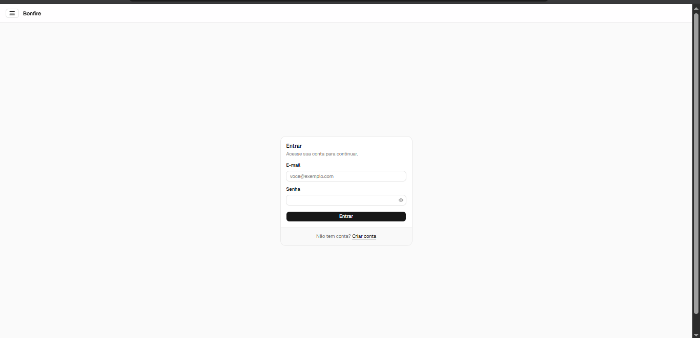
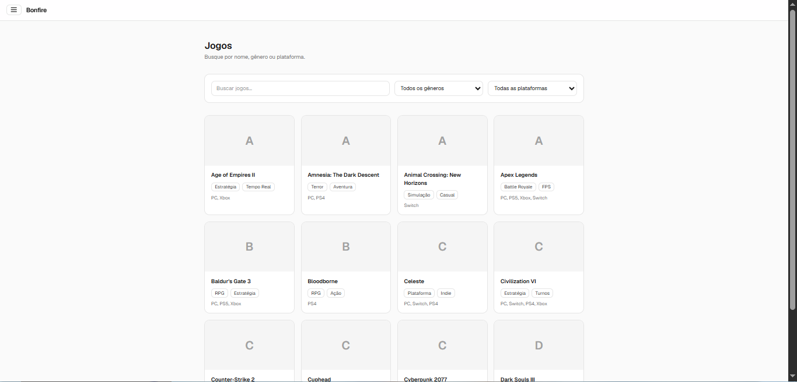
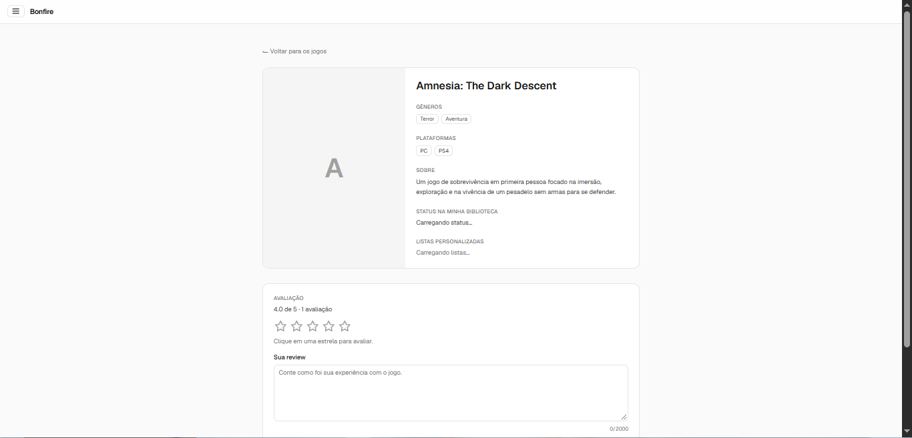
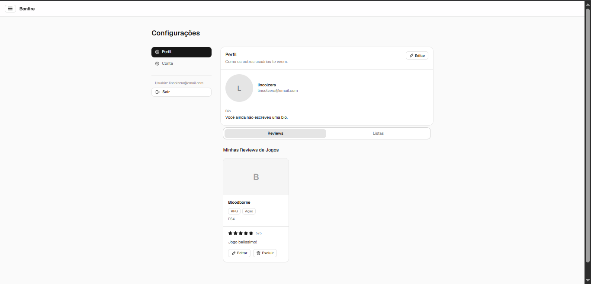
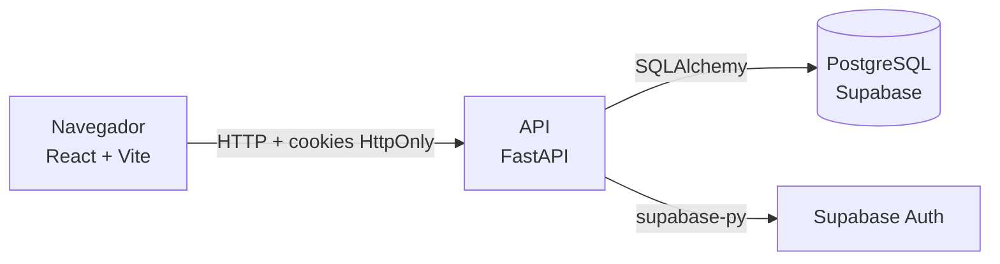

<div align="center">

# 🔥 Bonfire

**Sua fogueira para falar de jogos.**


</div>

O **Bonfire** é uma rede social de avaliação de jogos. Nela, o jogador descobre títulos por nome, gênero ou plataforma, avalia com estrelas, escreve reviews detalhadas, organiza o que já jogou e o que pretende jogar em listas e mantém um perfil com foto e bio.

A **primeira entrega** cobre a base da plataforma: contas, catálogo, avaliações, reviews, perfil e listas. A **próxima entrega** leva o projeto para o lado social, com seguidores, feed e um sistema de recomendação (veja o [Roadmap](#roadmap)).

Projeto desenvolvido no Lab de Engenharia de Software (ADS) da Fatec São José dos Campos.

<!-- TODO: as imagens abaixo assumem a pasta docs/img/. Se os prints estão em outra pasta, ajuste o caminho em todo o arquivo. -->

## Telas

| Login | Catálogo de jogos |
| :---: | :---: |
|  |  |
| **Detalhes do jogo** | **Perfil** |
|  |  |

## Sumário

- [Funcionalidades](#funcionalidades)
- [Roadmap](#roadmap)
- [Tecnologias](#tecnologias)
- [Arquitetura](#arquitetura)
- [Como rodar localmente](#como-rodar-localmente)
- [Variáveis de ambiente](#variáveis-de-ambiente)
- [Documentação da API](#documentação-da-api)
- [Testes](#testes)
- [Fluxo de trabalho da equipe](#fluxo-de-trabalho-da-equipe)
- [Equipe](#equipe)

## Funcionalidades

✅ entregue na 1ª entrega · 🔜 planejado para a próxima entrega

### Requisitos funcionais (RF)

| Código | Requisito | Status |
| ------ | --------- | :----: |
| RF01 | Publicar avaliações de jogos com estrelas e resenhas detalhadas | ✅ |
| RF02 | Personalizar o perfil com "Jogados" e "Pretendo Jogar" | ✅ |
| RF03 | Seguir outros usuários e interagir no feed social | 🔜 |
| RF04 | Sistema de recomendações de jogos baseado em preferências e avaliações | 🔜 |

Para sustentar esses requisitos, a primeira entrega também inclui cadastro e login, busca de jogos por nome, gênero e plataforma, página de detalhes, edição e exclusão das próprias reviews, listas personalizadas e edição dos dados da conta.

<details>
<summary>Detalhamento por requisito do backlog</summary>

<!-- TODO: confira os status e acrescente os códigos que faltarem. -->

| Código | Funcionalidade | Relacionado a | Status |
| ------ | -------------- | :-----------: | :----: |
| REQ-01 | Cadastro com e-mail e senha | Base | ✅ |
| REQ-02 | Login e logout seguros | Base | ✅ |
| REQ-03 | Perfil com foto e bio | RF02 | ✅ |
| REQ-04 | Marcar jogos como "Jogados", "Pretendo Jogar" e "Biblioteca" | RF02 | ✅ |
| REQ-05 | Pesquisar jogos por nome, gênero ou plataforma | Base | ✅ |
| REQ-06 | Página de detalhes do jogo | Base | ✅ |
| REQ-07 | Avaliar um jogo com notas de 1 a 5 estrelas | RF01 | ✅ |
| REQ-08 | Escrever uma review detalhada sobre um jogo | RF01 | ✅ |
| REQ-09 | Editar ou excluir as próprias avaliações e reviews | RF01 | ✅ |
| REQ-10 | Criar listas personalizadas de jogos | RF02 | ✅ |
| REQ-11 | Adicionar ou remover jogos das listas | RF02 | ✅ |
| REQ-17 | Editar os dados da conta (e-mail e senha) | Base | ✅ |

O backlog completo e os épicos estão em [`docs/`](docs/).

</details>

### Requisitos não funcionais (RNF)

| Código | Requisito | Como é atendido | Status |
| ------ | --------- | --------------- | :----: |
| RNF01 | **BD relacional:** chaves estrangeiras e índices em PostgreSQL | `reviews.game_id` referencia `games.id` com exclusão em cascata, índices em `games.name`, `reviews.user_id` e `reviews.game_id`, restrição única `(user_id, game_id)` e `CHECK` da nota entre 1 e 5 | ✅ |
| RNF02 | **Design Patterns:** Observer para feed e notificações, e Strategy para recomendações | Serão aplicados junto do feed social e do sistema de recomendação | 🔜 |
| RNF03 | **Desempenho:** feed social carregado em menos de 600 ms | Meta do feed da próxima entrega. Na primeira entrega, o catálogo já usa paginação, busca com espera de 300 ms entre as teclas e filtros carregados sob demanda | 🔜 |
| RNF04 | **React SPA:** interface dinâmica com atualização de estado | Página única com React Router. Notas, médias, reviews e listas atualizam na tela sem recarregar a página | ✅ |

Além dos RNF acima, a primeira entrega já inclui:

- **Segurança:** sessão por cookies `HttpOnly`, CORS restrito à origem do front e senha atual exigida para trocar e-mail ou senha.
- **Validação nos dois lados:** Zod no front e Pydantic no backend, com os mesmos limites.
- **Acessibilidade e responsividade:** campos com rótulos, navegação por teclado nas estrelas e menu lateral adaptado para celular.

## Roadmap

### Entrega 1: base da plataforma ✅

- [x] Cadastro, login, logout e sessão por cookie
- [x] Perfil com nome de exibição, bio e foto
- [x] Edição dos dados da conta (e-mail e senha)
- [x] Catálogo com busca por nome e filtros de gênero e plataforma
- [x] Página de detalhes do jogo
- [x] Avaliação por estrelas e média das notas
- [x] Reviews detalhadas, com edição e exclusão
- [x] Reviews da comunidade, com foto e nome do autor
- [x] Marcação de jogos como "Jogados", "Pretendo Jogar" e "Biblioteca"
- [x] Listas personalizadas de jogos
- [x] Perfil com abas de reviews e listas
- [x] Menu lateral responsivo
- [x] Migrations versionadas e modelagem do banco

### Entrega 2: rede social, frontend e recomendação 🔜

<!-- TODO: ajuste este planejamento ao que a equipe combinar. -->

**Rede social (RF03)**
- [ ] Seguir e deixar de seguir usuários
- [ ] Perfil público de outros usuários, com reviews e listas
- [ ] Feed social com as atividades de quem o usuário segue
- [ ] Curtidas e comentários nas reviews
- [ ] Notificações, com o padrão **Observer** (RNF02)
- [ ] Feed carregado em menos de 600 ms, com paginação e índices (RNF03)

**Melhorias no frontend**
- [ ] Refinamento da identidade visual e página inicial com destaques
- [ ] Capas dos jogos e carga inicial do catálogo
- [ ] Estados de carregamento, vazio e erro mais cuidadosos
- [ ] Renovação automática da sessão
- [ ] Revisão de acessibilidade e responsividade

**Sistema de recomendação (RF04)**
- [ ] Perfil de preferências calculado a partir de gêneros e notas
- [ ] Estratégias intercambiáveis de recomendação com o padrão **Strategy** (RNF02), por exemplo gênero favorito, usuários com gosto parecido e jogos bem avaliados por quem o usuário segue
- [ ] Seção "Recomendados para você"

**Qualidade e entrega**
- [ ] Testes automatizados de jogos, reviews, conta e feed
- [ ] Deploy do front e da API

## Tecnologias

| Camada | Tecnologias | Para que usamos |
| ------ | ----------- | --------------- |
| Frontend | React, TypeScript, Vite | Interface em página única (SPA) |
| | React Router | Rotas e proteção das páginas que exigem login |
| | Tailwind CSS e shadcn/ui | Estilo e componentes de interface |
| | React Hook Form e Zod | Formulários e validação |
| | Tabler Icons | Ícones |
| Backend | Python, FastAPI | API REST |
| | SQLAlchemy 2 e Psycopg 3 | Acesso ao banco |
| | Alembic | Migrations do banco |
| | Pydantic e pydantic-settings | Validação de dados e configuração |
| | Uvicorn | Servidor da aplicação |
| Banco de dados | PostgreSQL (Supabase) | Armazenamento dos dados |
| Autenticação | Supabase Auth | Contas, login e troca de e-mail e senha |
| Ferramentas | uv | Ambiente e dependências do Python |
| | Pytest | Testes do backend |
| | Git, GitHub | Versionamento e Pull Requests |

## Arquitetura

### Visão geral



O front conversa só com a API. A API acessa o banco e o Supabase Auth, e o navegador nunca vê as chaves do Supabase.

### Banco de dados


<!-- TODO: complete a tabela com as tabelas de biblioteca (Jogados, Pretendo Jogar) e de listas, conforme a modelagem acima. -->

| Tabela | Descrição |
| ------ | --------- |
| `games` | Catálogo de jogos. Gêneros e plataformas ficam em listas de texto, em minúsculas e sem acento (por exemplo `acao` e `ps5`). |
| `reviews` | Nota (1 a 5) e review opcional de cada usuário. Há uma única linha por par `user_id` e `game_id`. |
| `profiles` | Nome de exibição, bio e foto do usuário. |

`auth.users` pertence ao Supabase Auth. O campo `reviews.user_id` guarda o id do usuário, sem chave estrangeira.

### Backend

A API fica em `backend/app` e é dividida em camadas:

| Pasta | Responsabilidade |
| ----- | ---------------- |
| `routers/` | Endpoints HTTP, agrupados em `api.py` |
| `schema/` | Modelos Pydantic de entrada e saída |
| `models/` | Tabelas (SQLAlchemy) |
| `services/` | Integração com o Supabase Auth |
| `db/` | Engine e sessão do banco |
| `dependencies.py` | Dependência que identifica o usuário logado pelo cookie |

**Autenticação:** no login, a API recebe o e-mail e a senha, valida no Supabase Auth e grava os tokens em cookies `HttpOnly`. As rotas protegidas leem o cookie `access_token` pela dependência `get_current_user`. Sem sessão válida, respondem `401`.

### Frontend

O front fica em `frontend/src`:

| Pasta | Conteúdo |
| ----- | -------- |
| `pages/` | Telas, uma por rota |
| `features/` | Fluxos completos: `auth`, `profile`, `reviews` e `account` |
| `components/` | Componentes reutilizáveis (`ui`, `layout`, `game` e `profile`) |
| `lib/` | Cliente HTTP, chamadas da API de jogos e utilitários |
| `router.tsx` | Definição das rotas |

<!-- TODO: confirme as rotas e acrescente as de cadastro, biblioteca e listas. -->

| Rota | Tela | Acesso |
| ---- | ---- | ------ |
| `/login` | Login | Público |
| `/bonfirehub` | Lista de jogos com busca e filtros | Público |
| `/jogos/:id` | Detalhes, avaliação e reviews do jogo | Público (avaliar exige login) |
| `/settings/perfil` | Perfil, com abas de reviews e listas | Logado |
| `/settings/conta` | E-mail e senha da conta | Logado |

As rotas `/settings/*` usam o loader `requireSession`, que redireciona para o login quando não há sessão.

### Estrutura de pastas

```
.
├── backend/
│   ├── alembic/              # migrations
│   ├── app/
│   │   ├── main.py
│   │   ├── config.py
│   │   ├── dependencies.py
│   │   ├── db/
│   │   ├── models/
│   │   ├── routers/
│   │   ├── schema/
│   │   └── services/
│   ├── test/
│   ├── alembic.ini
│   ├── pyproject.toml
│   └── .env.example
├── frontend/
│   └── src/
│       ├── components/
│       ├── features/
│       ├── lib/
│       ├── pages/
│       └── router.tsx
├── docs/                     # backlog, épicos, prints das telas e modelagem do banco
│   └── img/
└── README.md
```

## Como rodar localmente

### Pré-requisitos

<!-- TODO: confirme as versões mínimas no pyproject.toml e no package.json. -->

- Python 3.12 ou superior
- [uv](https://docs.astral.sh/uv/)
- Node.js 20 ou superior
- Um projeto no [Supabase](https://supabase.com) (banco de dados e autenticação)

### 1. Clonar o repositório

```bash
git clone <URL-DO-REPOSITORIO>
cd <PASTA-DO-REPOSITORIO>
```

### 2. Backend

```bash
cd backend
cp .env.example .env        # no Windows: copy .env.example .env
```

Preencha o `.env` (veja [Variáveis de ambiente](#variáveis-de-ambiente)) e rode:

```bash
uv sync                                  # instala as dependências
uv run alembic upgrade head              # cria as tabelas no banco
uv run uvicorn app.main:app --reload     # sobe a API
```

A API fica em `http://localhost:8000`, e a documentação interativa em `http://localhost:8000/docs`.

### 3. Frontend

Em outro terminal:

```bash
cd frontend
npm install
```

Crie o arquivo `frontend/.env`:

```env
VITE_API_URL=http://localhost:8000
```

```bash
npm run dev
```

A aplicação abre em `http://localhost:5173`. Para ver a lista de jogos, acesse `/bonfirehub`.

> **Dica:** a tabela `games` começa vazia. Cadastre jogos pelo SQL Editor do Supabase ou com um script de carga para ver a lista funcionando.

## Variáveis de ambiente

Os valores nunca vão para o Git. O `.env` está no `.gitignore`, e só o `.env.example` fica no repositório.

### Backend (`backend/.env`)

| Variável | Obrigatória | Descrição |
| -------- | :---------: | --------- |
| `DATABASE_URL` | Sim | String de conexão do Postgres, no formato `postgresql+psycopg://postgres.<ref>:<senha>@<host>:5432/postgres`. Use a conexão **Session pooler** do Supabase (botão *Connect*), que funciona em redes sem IPv6. |
| `SUPABASE_URL` | Sim | URL do projeto Supabase |
| `SUPABASE_ANON_KEY` | Sim | Chave pública (*anon* ou *publishable*) do Supabase |
| `FRONTEND_URL` | Sim | Origem do front, usada no CORS (`http://localhost:5173`) |
| `AUTH_COOKIE_SECURE` | Não | `false` em desenvolvimento (HTTP) e `true` em produção (HTTPS) |
| `SECRET_KEY` | Não | Chave secreta da aplicação (há um valor padrão para desenvolvimento) |
| `SUPABASE_SERVICE_ROLE_KEY` | Não | Chave de administrador. Opcional: se informada, a troca de e-mail é aplicada na hora, sem link de confirmação. **Nunca** compartilhe nem commite. |

### Frontend (`frontend/.env`)

| Variável | Descrição |
| -------- | --------- |
| `VITE_API_URL` | URL da API (`http://localhost:8000`) |

## Documentação da API

A documentação interativa (Swagger) fica em `http://localhost:8000/docs` com a API rodando. Resumo dos endpoints:

<!-- TODO: acrescente os endpoints de biblioteca (Jogados, Pretendo Jogar) e de listas. -->

| Método | Rota | Acesso | Descrição |
| ------ | ---- | :----: | --------- |
| GET | `/health` | Público | Verifica a API e a conexão com o banco |
| POST | `/auth/register` | Público | Cadastro |
| POST | `/auth/login` | Público | Login (grava os cookies de sessão) |
| POST | `/auth/refresh` | Cookie | Renova a sessão |
| GET | `/auth/me` | Login | Usuário logado |
| POST | `/auth/logout` | Login | Encerra a sessão |
| GET | `/games` | Público | Busca com filtros `name`, `genre` e `platform`, paginada |
| GET | `/games/filters` | Público | Gêneros e plataformas existentes |
| GET | `/games/{id}` | Público | Detalhes do jogo, com média das notas |
| GET | `/games/{id}/reviews` | Público | Reviews da comunidade, com foto e nome do autor |
| GET | `/games/{id}/rating/me` | Login | Nota e review do usuário neste jogo |
| PUT | `/games/{id}/rating` | Login | Define ou altera a nota (1 a 5) |
| PUT | `/games/{id}/review` | Login | Publica ou atualiza a review |
| DELETE | `/games/{id}/review` | Login | Exclui a review e a nota do usuário |
| GET | `/users/me/reviews` | Login | Reviews do usuário, com os dados do jogo |
| GET, PUT | `/users/me/profile` | Login | Perfil (nome, bio e foto) |
| PUT | `/users/me/account/email` | Login | Altera o e-mail (exige a senha atual) |
| PUT | `/users/me/account/password` | Login | Altera a senha (exige a senha atual) |

## Testes

```bash
cd backend
uv run pytest
```

Cobertura atual: autenticação (`test/test_auth.py`). Testes de jogos, reviews, conta e feed estão previstos no [Roadmap](#roadmap).

## Fluxo de trabalho da equipe

- **Branches:** uma por requisito, no padrão `feature/REQ-05-Busca-jogos`.
- **Commits:** [Conventional Commits](https://www.conventionalcommits.org/pt-br/), por exemplo `feat(backend): adiciona busca de jogos` e `refactor(frontend): migra projeto de JSX para TSX`.
- **Pull Requests:** cada PR tem a descrição da atividade, como testar e o resultado esperado.
- **Migrations:** uma por mudança no banco. Migration já aplicada não é editada, e uma nova corrige o que for preciso. Antes de gerar uma, rode `git pull` e confira com `uv run alembic heads` que existe um único head.

## Equipe

<!-- TODO: preencha com os dados de cada integrante. -->

| Nome | Papel | GitHub |
| ---- | ----- | ------ |
| Lincoln Borsoi Moreira | Desenvolvedor | [@usuario](https://github.com/Dollar2006) |
| João Alvaro | Desenvolvedor | [@usuario](https://github.com/JoaoAlv4ro) |
| Guilherme Caçula | Desenvolvedor | [@usuario](https://github.com/usuario) |

---

<div align="center">

Projeto desenvolvido no Lab de Engenharia de Software · Fatec São José dos Campos

</div>
